# Bit24 Impulsa - Frontend

[](https://react.dev/)
[](https://vitejs.dev/)
[](https://www.typescriptlang.org/)
[](https://tailwindcss.com/)
[](https://reactrouter.com/)
[](https://axios-http.com/)

---

## Descripción del proyecto

**Bit24 Impulsa** es un proyecto universitario orientado a la adopción digital en entorno ERP (caso piloto: **REGENDA**).  
Este repositorio contiene el **frontend web**, construido en React y trabajado bajo Scrum.

La aplicación actualmente está en construcción y ya cuenta con base visual, navegación interna y autenticación conectada al backend.

---

## Objetivo del frontend

Construir una interfaz moderna, modular y escalable que permita:

- autenticar usuarios según rol;
- visualizar módulos del sistema de adopción;
- evolucionar por incrementos de sprint sin bloquear el avance.

---

## Arquitectura (estado actual)

El frontend sigue una organización por capas dentro de `src/app`:

- **`api/`**: servicios HTTP y cliente Axios (`auth`, `axiosClient`).
- **`context/`**: estado global de sesión (`AuthContext`).
- **`components/`**:
  - `layout/` (estructura principal, `AppShell`);
  - `ui/` y `ui-shared/` (componentes reutilizables);
  - `ProtectedRoute` para control de acceso.
- **`pages/`**: pantallas de negocio.
- **`data/`**: datos/configuración de demo utilizados en esta etapa.

Flujo actual de autenticación:

1. `LoginScreen` -> `POST /auth/login`
2. `AuthContext` guarda token/usuario
3. `ProtectedRoute` permite/deniega acceso
4. `AppShell` renderiza navegación y vistas internas

---

## Estructura de carpetas

```text
src/
├── app/
│   ├── api/
│   │   ├── auth.ts
│   │   └── axiosClient.ts
│   ├── components/
│   │   ├── figma/
│   │   ├── layout/
│   │   │   └── AppShell.tsx
│   │   ├── ui/
│   │   ├── ui-shared/
│   │   └── ProtectedRoute.tsx
│   ├── context/
│   │   └── AuthContext.tsx
│   ├── data/
│   │   └── datosRegenda.ts
│   ├── pages/
│   │   ├── LoginScreen.tsx
│   │   ├── DashboardView.tsx
│   │   ├── RutaView.tsx
│   │   ├── MicroaprendizajeView.tsx
│   │   ├── AsistenteIAView.tsx
│   │   ├── AlertasView.tsx
│   │   ├── SoporteView.tsx
│   │   ├── PanelResponsableView.tsx
│   │   ├── TecnologiasView.tsx
│   │   └── GestionUsuarios.tsx
│   └── App.tsx
├── styles/
└── main.tsx
```

---

## Tecnologías

- **React**
- **Vite**
- **TypeScript**
- **Tailwind CSS**
- **React Router**
- **Axios**

---

## Instalación

```bash
npm install
```

---

## Variables de entorno

Actualmente la URL del backend está fija en `src/app/api/axiosClient.ts`:

```ts
baseURL: "http://localhost:8000"
```

Recomendación para próximos incrementos:

```env
VITE_API_BASE_URL=http://localhost:8000
```

> Nota: esta variable aún no está integrada en el código.

---

## Cómo ejecutar el proyecto

### Desarrollo

```bash
npm run dev
```

Abrir en navegador: `http://localhost:5173`

### Build de producción

```bash
npm run build
```

---

## Estado actual del Sprint (20%)

- **Sprint**: Sprint 1 (2 semanas)
- **Día estimado**: 3-4
- **Avance general**: ~20%

```text
[████░░░░░░░░░░░░░░░░] 20% Completado
```

### Situación real del desarrollo

- Base técnica del frontend lista.
- Login conectado al backend y flujo de sesión funcionando.
- Layout principal modularizado (`AppShell`).
- Varias vistas aún dependen de datos simulados y requieren integración progresiva con API real.

---

## Funcionalidades implementadas

- Estructura base de proyecto React + Vite + TypeScript.
- Enrutamiento principal con React Router.
- Protección de rutas con `ProtectedRoute`.
- Gestión de sesión/token en `AuthContext`.
- Integración de login con backend mediante Axios (`/auth/login`).
- Layout principal con navegación lateral y cabecera.
- Separación por pantallas y componentes reutilizables (`ui`, `ui-shared`).

---

## Funcionalidades en desarrollo

- Integración de endpoints reales para módulos funcionales (más allá de auth).
- Consolidación de manejo de errores y estados de carga en todas las vistas.
- Normalización de consumo de datos actualmente mockeados.
- Pruebas automatizadas (unitarias/e2e).
- Optimización de bundle y estrategia de code splitting.

---

## Roadmap

```mermaid
gantt
    title Bit24 Impulsa Frontend - Roadmap académico
    dateFormat  D
    axisFormat Día %d

    section Sprint 1
    Base del frontend + auth + layout      :active, s1a, 1, 4d
    Integración inicial de vistas          :s1b, 4, 4d
    Ajustes de estabilidad                 :s1c, 8, 6d

    section Sprint 2
    Conexión módulos con API real          :s2a, 15, 7d
    Estados de error/loading consistentes  :s2b, 19, 6d

    section Sprint 3
    Testing y hardening técnico            :s3a, 29, 8d
    Optimización y preparación de demo     :s3b, 34, 6d
```



---

## Diseño basado en Figma

El frontend se implementa a partir de diseño base en Figma, con adaptación progresiva a componentes React reutilizables.

- Se mantiene coherencia visual entre pantallas.
- Se prioriza primero estructura y navegación (Sprint 1), luego integración completa de negocio.
- El diseño actual corresponde a una etapa temprana de construcción (no versión final).

---

## Convenciones de componentes

- Un componente/pantalla por archivo.
- Nombres en **PascalCase** para componentes.
- Uso de `export default` para pantallas y layout principal.
- Componentes reutilizables en `components/ui` y `components/ui-shared`.
- Acceso HTTP centralizado en `app/api`.
- Estado de autenticación centralizado en `app/context/AuthContext.tsx`.

---

## Licencia

Proyecto desarrollado con fines académicos para universidad.  
Uso interno del equipo y contexto educativo.

---

Desarrollado bajo marco Scrum · 2026.
  